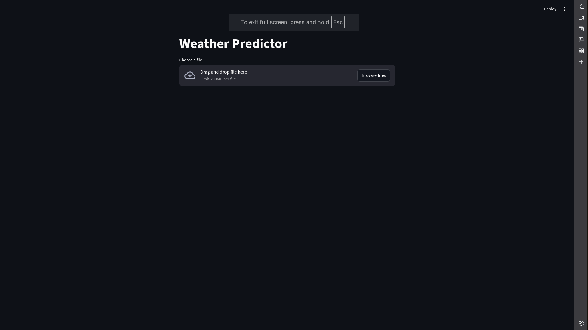
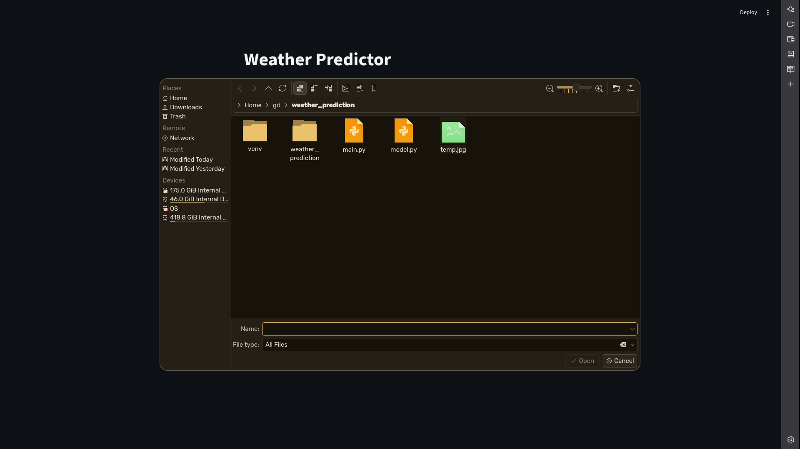
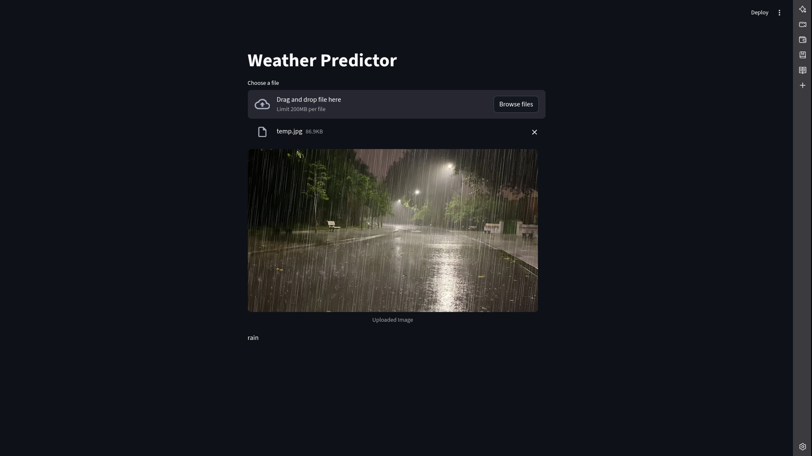
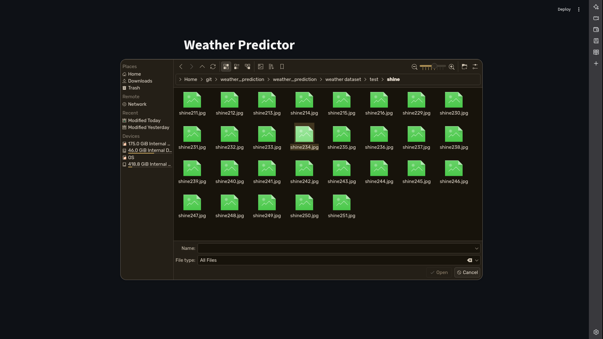
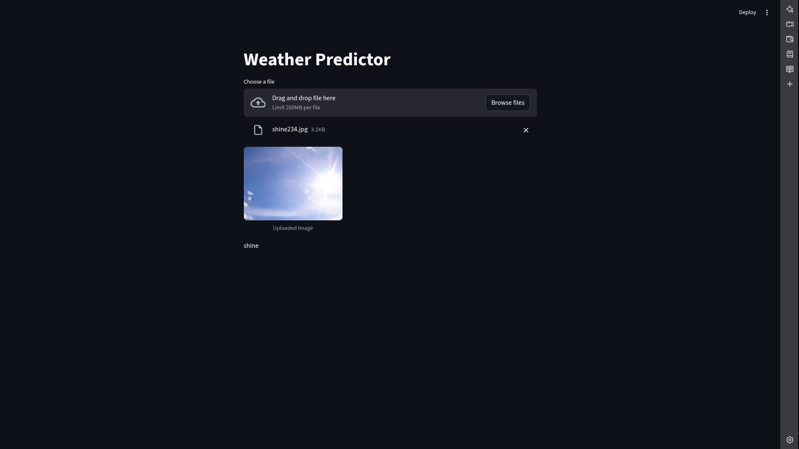

## Overview

This project provides a convolutional-neural-network–based system for classifying weather conditions from images. A trained model is paired with a Streamlit interface for real-time predictions. Users upload an image, the system preprocesses it, runs inference, and returns the predicted weather class.

  

## Model Summary

The training pipeline in `model.py` :contentReference[oaicite:0]{index=0} builds a CNN designed to recognize patterns in weather imagery.

  

### What the CNN Does

- **Extracts hierarchical features:** Early layers identify edges, shapes, and textures. Deeper layers recognize weather-specific cues such as cloud density, sky gradients, and lighting conditions.

- **Compresses spatial information:** MaxPooling operations reduce dimensionality while keeping critical visual signals.

- **Maps features to weather classes:** Dense layers convert learned patterns into a probability distribution over available categories.

- **Outputs a final class:** A softmax layer selects the most probable weather condition.

  

---

  

## Training Workflow

- Uses `ImageDataGenerator` for scaling and augmentation.

- Architecture:

- Input → Conv2D(16) → MaxPool

- Conv2D(32) → MaxPool

- Conv2D(64) → MaxPool

- Flatten → Dense(256) → Softmax

- Trained with Adam optimizer and early stopping.

- Evaluated using accuracy and classification metrics.

- Saved as `weather.keras` for use in the UI.

  

---

  

## Streamlit UI

The interface in `main.py` :contentReference[oaicite:1]{index=1} loads the saved model, accepts image uploads, preprocesses them, and displays the predicted class.

  








  

---

  

## How to Use

1. **Train the model (optional if the `.keras` file already exists):**

```bash
python model.py
```

2. **Run the Streamlit application:**  

``` bash

streamlit run main.py
```

  

Upload an image through the UI and view the prediction.

  

## Input Requirements

  

Accepts standard image formats (JPG, PNG).

  

Automatically resized to 224×224 before inference.

  

## Dependencies

  

1. TensorFlow

2. Streamlit

3. NumPy

4. scikit-learn
